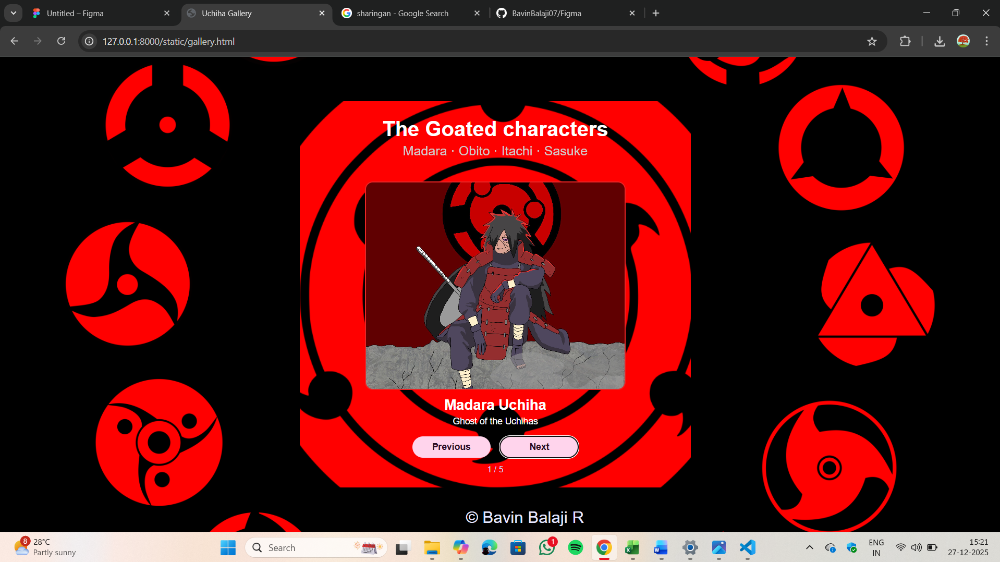
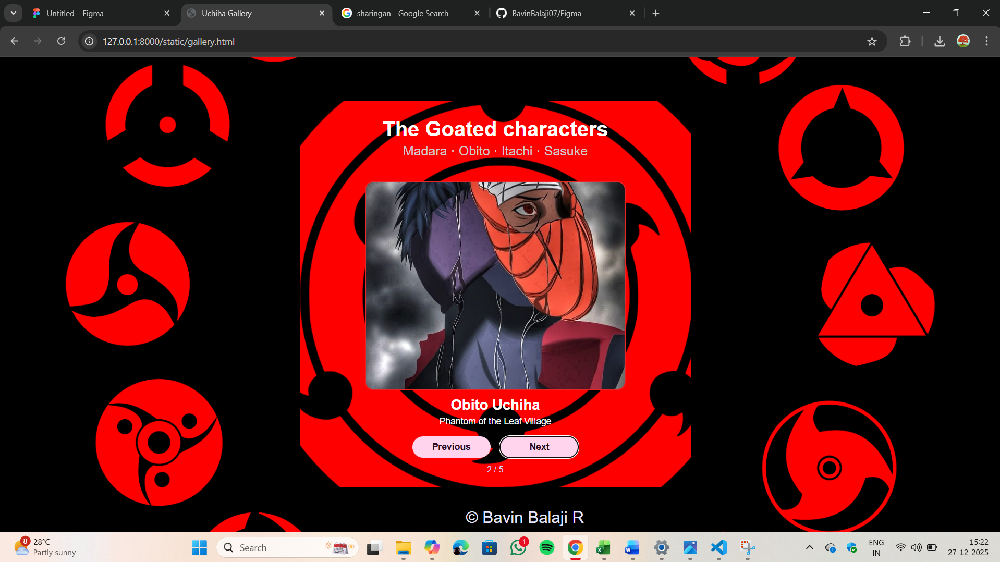
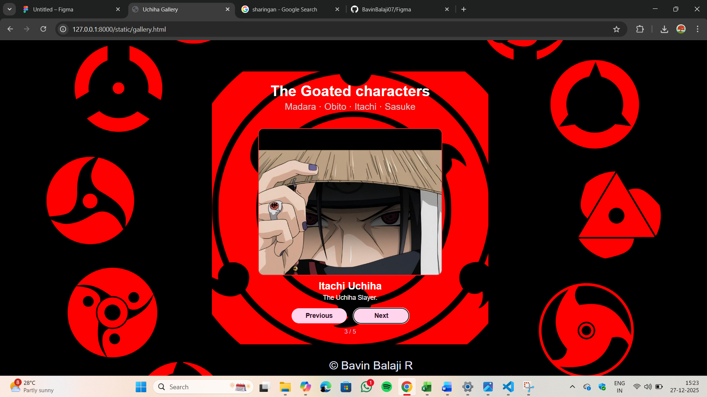
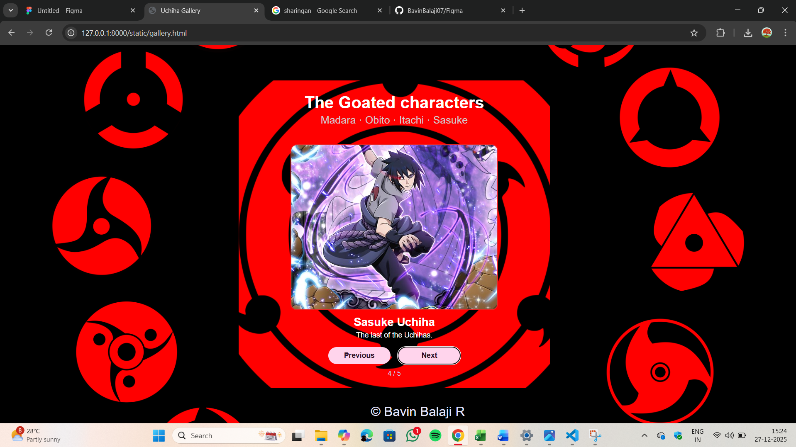
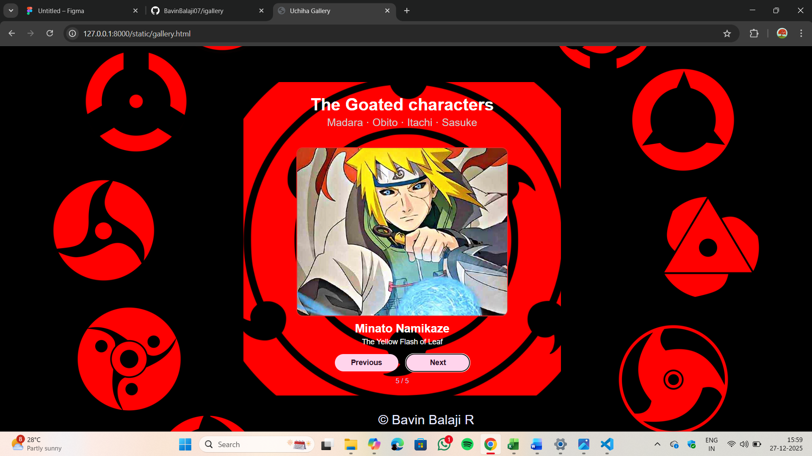

# Ex.07 Design of Interactive Image Gallery
## Date:27-12-2025

## AIM:
To design a web application for an interactive image gallery for a minimum five images with next and previous buttons.

## DESIGN STEPS:

### Step 1:
Clone the github repository and create Django admin interface.

### Step 2:
Change settings.py file to allow request from all hosts.

### Step 3:
Use CSS for positioning and styling.

### Step 4:
Write JavaScript program for implementing interactivity.

### Step 5:
Validate the HTML and CSS code.

### Step 6:
Publish the website in the given URL.

## PROGRAM:

~~~
gallery.html
<html>
<head>
    <meta charset="UTF-8">
    <title>Uchiha Gallery</title>
    <link rel="stylesheet" href="style.css">
</head>
<body>
    

        <h1 class="heading">The Goated characters</h1>
        
Madara · Obito · Itachi · Sasuke  

        

            

            
Madara Uchiha

            

                Ghost of the Uchihas
            

        

        

            <button onclick="prev()">Previous</button>
            <button onclick="next()">Next</button>
        

        
1 / 6

    

    <footer class="footer">
        &copy; Bavin Balaji R
    </footer>

    
</body>
</html>
style.css
*{
    margin: 0;
    padding: 0;
    box-sizing: border-box;
}
body {
    font-family: Arial, sans-serif;
    background: url("sharingan.png") no-repeat center center fixed;
    background-size: cover;
    min-height: 100vh;
    display: flex;
    flex-direction: column;
    justify-content: space-between;
    text-align: center;
    color: white;
}
.box {
    width: 90%;
    max-width: 600px;
    margin-left:460px;
    padding: 20px;
    
    border-radius: 15px;
    margin-top:68px;
    background: url("sharingan.png") no-repeat center center fixed;
}
.heading {
    font-size: 32px;
    margin-bottom: 4px;
    margin-top:5px;
}
.small-text {
    font-size: 20px;
    margin-bottom: 15px;
    color: #d2caca;
}
.image-area img {
    margin-top:20px;
    width: 100%;
    max-width:400px;
    height: 320px;
    object-fit: cover;
    border-radius: 12px;
    border: 2px solid #e92525;
}
.title {
    margin-top: 10px;
    font-size: 22px;
    font-weight: bold;
}
.info {
    margin-top: 4px;
    font-size: 14px;
}
.buttons {
    margin-top: 15px;
    display: flex;
    justify-content: center;
    gap: 15px;
}
.buttons button {
    width: 120px;
    padding: 8px;
    font-size: 14px;
    font-weight: bold;
    border-radius: 20px;
    border: none;
    cursor: pointer;
    background-color: #ffd4ec;
    color: #2b1022;
}
.count {
    margin-top: 10px;
    font-size: 13px;
    color: #cdd4ff;
}
.footer {
    margin-left:75px;
    font-size: 25px;
    padding: 8px;
    color: #e5e7ff;
}
text.js
var pics = [
    {
        image: "madara.jpg",
        title: "Madara Uchiha",
        info: "Ghost of the Uchihas"
    },
    {
        image: "obito.jpeg",
        title: "Obito Uchiha",
        info: "Phantom of the Leaf Village"
    },
    {
        image: "itachi uchiha.jpeg",
        title: "Itachi Uchiha",
        info: "The Uchiha Slayer."
    },
    {
        image: "sas.jpeg",
        title: "Sasuke Uchiha",
        info: "The last of the Uchihas."
    },
    {
      image: "minatooo.jpeg",
        title: "Minato Namikaze",
        info: "The Yellow Flash of Leaf"
    }
];

var i = 0; 

var photo     = document.getElementById("photo");
var titleText = document.getElementById("title-text");
var infoText  = document.getElementById("info-text");
var countText = document.getElementById("count-text");

function show() {
    photo.src           = pics[i].image;
    titleText.innerHTML = pics[i].title;
    infoText.innerHTML  = pics[i].info;
    countText.innerHTML = (i + 1) + " / " + pics.length;
}
function next() {
    i++;
    if (i >= pics.length) {
        i = 0;
    }
    show();
}
function prev() {
    i--;
    if (i < 0) {
        i = pics.length - 1;
    }
    show();
}
show();

  

  
~~~

## OUTPUT:

## RESULT:
The program for designing an interactive image gallery using HTML, CSS and JavaScript is executed successfully.
